# Uncertain emotion discrimination differences between musicians and nonmusicians is determined by fine structure association: Hilbert transform psychophysics

**Authors:** Francis A.M. Manno, Raul R. Cruces, Condon Lau, Fernando A. Barrios  
**Contact:** <francis.manno@sydney.edu.au>, <raulrcruces@inb.unam.mx>, <fbarrios@unam.mx>, <condon.lau@cityu.edu.hk>  

**OSF:** <https://osf.io/8ws7a>  
**Keywords:** emotion; psychophysics; modulation; fine structure; envelope; frequency; amplitude  

Index
=====
-   [Abstract](#abstract)
-   [Code and Methods](#code-and-methods)
    -   [R 3.4.4, required packages](#r-3.4.4-required-packages)
-   [Group Heatmaps](#group-heatmaps)
    -   [Accuracy for both emotions: All subjects](#accuracy-for-both-emotions-all-subjects)
    -   [Fine Structure Accuracy by Gender](#fine-structure-accuracy-by-gender)
-   [Figure 2. Accuracy and discriminability concerning Happy and Sad](#figure-2.-accuracy-and-discriminability-concerning-happy-and-sad)
    -   [Accuracy calculaded by subjects and group](#accuracy-calculaded-by-subjects-and-group)
    -   [ANOVA: Comparisons between groups](#anova-comparisons-between-groups)
-   [Linear Discriminant Analysis: Happy](#linear-discriminant-analysis-happy)
-   [Linear Discriminant Analysis: Sad](#linear-discriminant-analysis-sad)
-   [Figure 4. Cannonical Discriminant Analysis (CDA)](#figure-4.-cannonical-discriminant-analysis-cda)


Abstract
========

Humans perceive musical sound as a complex phenomenon, which is known to induce an emotional response. The cues used to perceive emotion in music have not been unequivocally elucidated. Here, we sought to identify the attributes of sound that confer an emotion to music and determine if professional musicians have different musical emotion perception than nonmusicians. The objective was to determine which sound cues are used to resolve emotional signals. Happy or sad classical music excerpts modified in fine structure or envelope conveying different degrees of emotional certainty were presented. Certainty was determined by identification of the emotional characteristic presented during a forced-choice discrimination task. Participants were categorized as good or poor performers (n = 32, age age 21.16 ± 2.59 SD) and in a separate group as musicians in the first or last year of music education at a conservatory (n = 32, age 21.97 ± 2.42). We found that temporal fine structure information is essential for correct emotional identification. Nonmusicians used less fine structure information to discriminate emotion in music compared with musicians. The present psychophysical experiments revealed what cues are used to resolve emotional signals and how they differ between nonmusicians and musically educated individuals.

Code and Methods
================

The code for **figure 2** and **figure 4** can be found in `Final_figures.R`.

R 3.4.4, required packages
--------------------------

``` r
library(gplots)
library(gridExtra)
library(MASS)
library(pander)
library(magrittr)
library(dplyr)
library(ggplot2)
library(RCurl)
library(scatterplot3d)
library(klaR)
library(pander)
library(candisc)
```

Group Heatmaps
==============

This was created calculating the accuracy of each subject per stimuli. First, stimuli where binarized based in the answer of **Fine structure emotion**, with 1 if is correct and 0 when wrong. The total was divided by the total amount of stimuli or each category (nb0...nb64).

Accuracy for both emotions: All subjects
----------------------------------------


Fine Structure Accuracy by Gender
---------------------------------

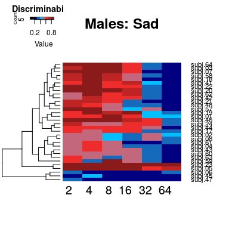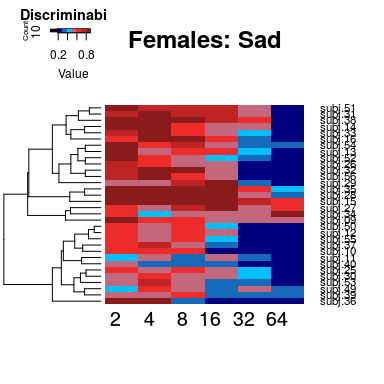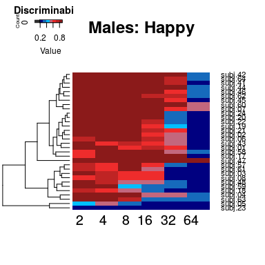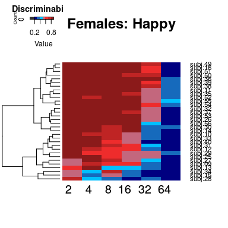

Figure 2. Accuracy and discriminability concerning Happy and Sad
================================================================

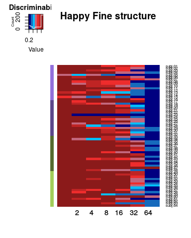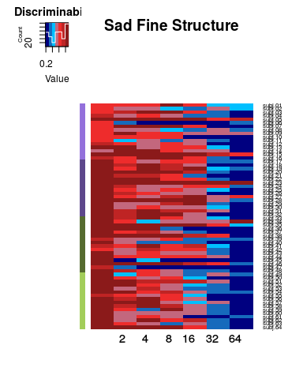

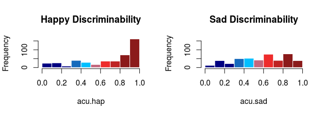

Accuracy calculaded by subjects and group
-----------------------------------------

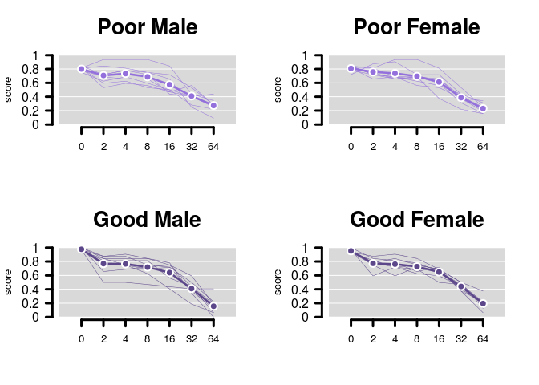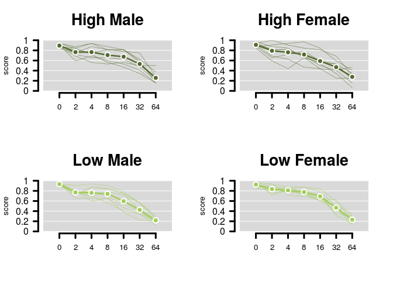

ANOVA: Comparisons between groups
---------------------------------

Is accuracy in the response given by the class belonging and gender?

<table>
<caption>ANOVA, accuracy by class</caption>
<colgroup>
<col width="35%" />
<col width="6%" />
<col width="15%" />
<col width="15%" />
<col width="12%" />
<col width="14%" />
</colgroup>
<thead>
<tr class="header">
<th align="center"> </th>
<th align="center">Df</th>
<th align="center">Sum Sq</th>
<th align="center">Mean Sq</th>
<th align="center">F value</th>
<th align="center">Pr(&gt;F)</th>
</tr>
</thead>
<tbody>
<tr class="odd">
<td align="center"><strong>factor(cases$class)</strong></td>
<td align="center">3</td>
<td align="center">0.2268</td>
<td align="center">0.0756</td>
<td align="center">60.55</td>
<td align="center">5.292e-18</td>
</tr>
<tr class="even">
<td align="center"><strong>factor(cases$gender)</strong></td>
<td align="center">1</td>
<td align="center">6.104e-05</td>
<td align="center">6.104e-05</td>
<td align="center">0.04888</td>
<td align="center">0.8258</td>
</tr>
<tr class="odd">
<td align="center"><strong>Residuals</strong></td>
<td align="center">59</td>
<td align="center">0.07367</td>
<td align="center">0.001249</td>
<td align="center">NA</td>
<td align="center">NA</td>
</tr>
</tbody>
</table>

-   **factor(cases$class)**:

    <table style="width:87%;">
    <colgroup>
    <col width="22%" />
    <col width="15%" />
    <col width="16%" />
    <col width="16%" />
    <col width="16%" />
    </colgroup>
    <thead>
    <tr class="header">
    <th align="center"> </th>
    <th align="center">diff</th>
    <th align="center">lwr</th>
    <th align="center">upr</th>
    <th align="center">p adj</th>
    </tr>
    </thead>
    <tbody>
    <tr class="odd">
    <td align="center"><strong>high-best</strong></td>
    <td align="center">-0.0625</td>
    <td align="center">-0.09553</td>
    <td align="center">-0.02947</td>
    <td align="center">3.147e-05</td>
    </tr>
    <tr class="even">
    <td align="center"><strong>low-best</strong></td>
    <td align="center">-0.03516</td>
    <td align="center">-0.06819</td>
    <td align="center">-0.002127</td>
    <td align="center">0.03271</td>
    </tr>
    <tr class="odd">
    <td align="center"><strong>poor-best</strong></td>
    <td align="center">-0.1602</td>
    <td align="center">-0.1932</td>
    <td align="center">-0.1271</td>
    <td align="center">1.795e-11</td>
    </tr>
    <tr class="even">
    <td align="center"><strong>low-high</strong></td>
    <td align="center">0.02734</td>
    <td align="center">-0.005686</td>
    <td align="center">0.06037</td>
    <td align="center">0.1383</td>
    </tr>
    <tr class="odd">
    <td align="center"><strong>poor-high</strong></td>
    <td align="center">-0.09766</td>
    <td align="center">-0.1307</td>
    <td align="center">-0.06463</td>
    <td align="center">6.858e-10</td>
    </tr>
    <tr class="even">
    <td align="center"><strong>poor-low</strong></td>
    <td align="center">-0.125</td>
    <td align="center">-0.158</td>
    <td align="center">-0.09197</td>
    <td align="center">1.813e-11</td>
    </tr>
    </tbody>
    </table>

-   **factor(cases$gender)**:

    <table style="width:72%;">
    <colgroup>
    <col width="13%" />
    <col width="15%" />
    <col width="15%" />
    <col width="13%" />
    <col width="13%" />
    </colgroup>
    <thead>
    <tr class="header">
    <th align="center"> </th>
    <th align="center">diff</th>
    <th align="center">lwr</th>
    <th align="center">upr</th>
    <th align="center">p adj</th>
    </tr>
    </thead>
    <tbody>
    <tr class="odd">
    <td align="center"><strong>M-F</strong></td>
    <td align="center">0.001953</td>
    <td align="center">-0.01572</td>
    <td align="center">0.01963</td>
    <td align="center">0.8258</td>
    </tr>
    </tbody>
    </table>

<!-- end of list -->

Linear Discriminant Analysis: Happy
===================================

$Group\\~nb0+nb2+nb4+nb8+nb16+nb32+nb64$

<table style="width:49%;">
<colgroup>
<col width="12%" />
<col width="12%" />
<col width="13%" />
<col width="9%" />
</colgroup>
<thead>
<tr class="header">
<th align="center">best</th>
<th align="center">high</th>
<th align="center">low</th>
<th align="center">poor</th>
</tr>
</thead>
<tbody>
<tr class="odd">
<td align="center">0.2031</td>
<td align="center">0.1406</td>
<td align="center">0.07812</td>
<td align="center">0.125</td>
</tr>
</tbody>
</table>

<table style="width:76%;">
<caption>LDA happy: Observed vs. Predicted Frequencies</caption>
<colgroup>
<col width="29%" />
<col width="9%" />
<col width="9%" />
<col width="8%" />
<col width="9%" />
<col width="9%" />
</colgroup>
<thead>
<tr class="header">
<th align="center"> </th>
<th align="center">best</th>
<th align="center">high</th>
<th align="center">low</th>
<th align="center">poor</th>
<th align="center">Sum</th>
</tr>
</thead>
<tbody>
<tr class="odd">
<td align="center"><strong>Predicted best</strong></td>
<td align="center">13</td>
<td align="center">2</td>
<td align="center">4</td>
<td align="center">2</td>
<td align="center">21</td>
</tr>
<tr class="even">
<td align="center"><strong>Predicted high</strong></td>
<td align="center">1</td>
<td align="center">9</td>
<td align="center">5</td>
<td align="center">2</td>
<td align="center">17</td>
</tr>
<tr class="odd">
<td align="center"><strong>Predicted low</strong></td>
<td align="center">1</td>
<td align="center">4</td>
<td align="center">5</td>
<td align="center">4</td>
<td align="center">14</td>
</tr>
<tr class="even">
<td align="center"><strong>Predicted poor</strong></td>
<td align="center">1</td>
<td align="center">1</td>
<td align="center">2</td>
<td align="center">8</td>
<td align="center">12</td>
</tr>
<tr class="odd">
<td align="center"><strong>Sum</strong></td>
<td align="center">16</td>
<td align="center">16</td>
<td align="center">16</td>
<td align="center">16</td>
<td align="center">64</td>
</tr>
</tbody>
</table>

Happy total % correct: 0.546875

<table style="width:99%;">
<caption>LDA sad: Observed vs. Predicted Proportions %</caption>
<colgroup>
<col width="29%" />
<col width="13%" />
<col width="13%" />
<col width="13%" />
<col width="13%" />
<col width="13%" />
</colgroup>
<thead>
<tr class="header">
<th align="center"> </th>
<th align="center">best</th>
<th align="center">high</th>
<th align="center">low</th>
<th align="center">poor</th>
<th align="center">Sum</th>
</tr>
</thead>
<tbody>
<tr class="odd">
<td align="center"><strong>Predicted best</strong></td>
<td align="center">0.2031</td>
<td align="center">0.03125</td>
<td align="center">0.0625</td>
<td align="center">0.03125</td>
<td align="center">0.3281</td>
</tr>
<tr class="even">
<td align="center"><strong>Predicted high</strong></td>
<td align="center">0.01562</td>
<td align="center">0.1406</td>
<td align="center">0.07812</td>
<td align="center">0.03125</td>
<td align="center">0.2656</td>
</tr>
<tr class="odd">
<td align="center"><strong>Predicted low</strong></td>
<td align="center">0.01562</td>
<td align="center">0.0625</td>
<td align="center">0.07812</td>
<td align="center">0.0625</td>
<td align="center">0.2188</td>
</tr>
<tr class="even">
<td align="center"><strong>Predicted poor</strong></td>
<td align="center">0.01562</td>
<td align="center">0.01562</td>
<td align="center">0.03125</td>
<td align="center">0.125</td>
<td align="center">0.1875</td>
</tr>
<tr class="odd">
<td align="center"><strong>Sum</strong></td>
<td align="center">0.25</td>
<td align="center">0.25</td>
<td align="center">0.25</td>
<td align="center">0.25</td>
<td align="center">1</td>
</tr>
</tbody>
</table>

<table style="width:51%;">
<caption>Happy: group means by LDA</caption>
<colgroup>
<col width="9%" />
<col width="13%" />
<col width="13%" />
<col width="13%" />
</colgroup>
<thead>
<tr class="header">
<th align="center">type</th>
<th align="center">LDA1</th>
<th align="center">LDA2</th>
<th align="center">LDA3</th>
</tr>
</thead>
<tbody>
<tr class="odd">
<td align="center">best</td>
<td align="center">-1.126</td>
<td align="center">-0.2657</td>
<td align="center">0.04361</td>
</tr>
<tr class="even">
<td align="center">high</td>
<td align="center">0.6722</td>
<td align="center">-0.4348</td>
<td align="center">0.2395</td>
</tr>
<tr class="odd">
<td align="center">low</td>
<td align="center">0.3626</td>
<td align="center">-0.262</td>
<td align="center">-0.317</td>
</tr>
<tr class="even">
<td align="center">poor</td>
<td align="center">0.09148</td>
<td align="center">0.9625</td>
<td align="center">0.03394</td>
</tr>
</tbody>
</table>

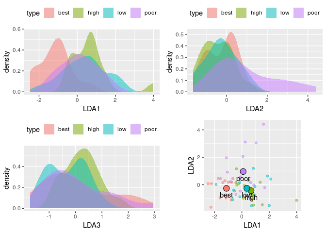

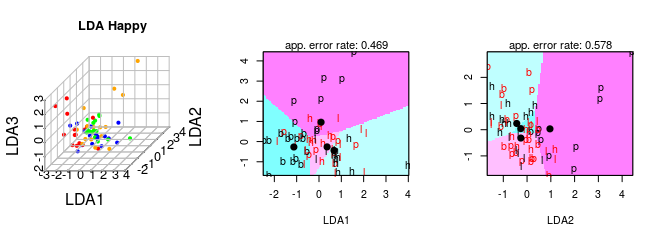

Linear Discriminant Analysis: Sad
=================================

<table style="width:49%;">
<colgroup>
<col width="12%" />
<col width="11%" />
<col width="12%" />
<col width="12%" />
</colgroup>
<thead>
<tr class="header">
<th align="center">best</th>
<th align="center">high</th>
<th align="center">low</th>
<th align="center">poor</th>
</tr>
</thead>
<tbody>
<tr class="odd">
<td align="center">0.1562</td>
<td align="center">0.125</td>
<td align="center">0.1562</td>
<td align="center">0.2031</td>
</tr>
</tbody>
</table>

<table style="width:76%;">
<caption>LDA sad: Observed vs. Predicted Frequencies</caption>
<colgroup>
<col width="29%" />
<col width="9%" />
<col width="9%" />
<col width="8%" />
<col width="9%" />
<col width="9%" />
</colgroup>
<thead>
<tr class="header">
<th align="center"> </th>
<th align="center">best</th>
<th align="center">high</th>
<th align="center">low</th>
<th align="center">poor</th>
<th align="center">Sum</th>
</tr>
</thead>
<tbody>
<tr class="odd">
<td align="center"><strong>Predicted best</strong></td>
<td align="center">10</td>
<td align="center">0</td>
<td align="center">1</td>
<td align="center">2</td>
<td align="center">13</td>
</tr>
<tr class="even">
<td align="center"><strong>Predicted high</strong></td>
<td align="center">2</td>
<td align="center">8</td>
<td align="center">4</td>
<td align="center">0</td>
<td align="center">14</td>
</tr>
<tr class="odd">
<td align="center"><strong>Predicted low</strong></td>
<td align="center">4</td>
<td align="center">4</td>
<td align="center">10</td>
<td align="center">1</td>
<td align="center">19</td>
</tr>
<tr class="even">
<td align="center"><strong>Predicted poor</strong></td>
<td align="center">0</td>
<td align="center">4</td>
<td align="center">1</td>
<td align="center">13</td>
<td align="center">18</td>
</tr>
<tr class="odd">
<td align="center"><strong>Sum</strong></td>
<td align="center">16</td>
<td align="center">16</td>
<td align="center">16</td>
<td align="center">16</td>
<td align="center">64</td>
</tr>
</tbody>
</table>

Sad total % correct: 0.640625

<table style="width:97%;">
<caption>LDA sad: Observed vs. Predicted Proportions %</caption>
<colgroup>
<col width="29%" />
<col width="13%" />
<col width="12%" />
<col width="13%" />
<col width="13%" />
<col width="13%" />
</colgroup>
<thead>
<tr class="header">
<th align="center"> </th>
<th align="center">best</th>
<th align="center">high</th>
<th align="center">low</th>
<th align="center">poor</th>
<th align="center">Sum</th>
</tr>
</thead>
<tbody>
<tr class="odd">
<td align="center"><strong>Predicted best</strong></td>
<td align="center">0.1562</td>
<td align="center">0</td>
<td align="center">0.01562</td>
<td align="center">0.03125</td>
<td align="center">0.2031</td>
</tr>
<tr class="even">
<td align="center"><strong>Predicted high</strong></td>
<td align="center">0.03125</td>
<td align="center">0.125</td>
<td align="center">0.0625</td>
<td align="center">0</td>
<td align="center">0.2188</td>
</tr>
<tr class="odd">
<td align="center"><strong>Predicted low</strong></td>
<td align="center">0.0625</td>
<td align="center">0.0625</td>
<td align="center">0.1562</td>
<td align="center">0.01562</td>
<td align="center">0.2969</td>
</tr>
<tr class="even">
<td align="center"><strong>Predicted poor</strong></td>
<td align="center">0</td>
<td align="center">0.0625</td>
<td align="center">0.01562</td>
<td align="center">0.2031</td>
<td align="center">0.2812</td>
</tr>
<tr class="odd">
<td align="center"><strong>Sum</strong></td>
<td align="center">0.25</td>
<td align="center">0.25</td>
<td align="center">0.25</td>
<td align="center">0.25</td>
<td align="center">1</td>
</tr>
</tbody>
</table>

<table style="width:51%;">
<caption>Happy: group means by LDA</caption>
<colgroup>
<col width="9%" />
<col width="13%" />
<col width="13%" />
<col width="13%" />
</colgroup>
<thead>
<tr class="header">
<th align="center">type</th>
<th align="center">LDA1</th>
<th align="center">LDA2</th>
<th align="center">LDA3</th>
</tr>
</thead>
<tbody>
<tr class="odd">
<td align="center">best</td>
<td align="center">-1.362</td>
<td align="center">0.4542</td>
<td align="center">0.1613</td>
</tr>
<tr class="even">
<td align="center">high</td>
<td align="center">0.04957</td>
<td align="center">-0.4957</td>
<td align="center">0.3254</td>
</tr>
<tr class="odd">
<td align="center">low</td>
<td align="center">-0.6249</td>
<td align="center">-0.2197</td>
<td align="center">-0.4475</td>
</tr>
<tr class="even">
<td align="center">poor</td>
<td align="center">1.937</td>
<td align="center">0.2612</td>
<td align="center">-0.03927</td>
</tr>
</tbody>
</table>

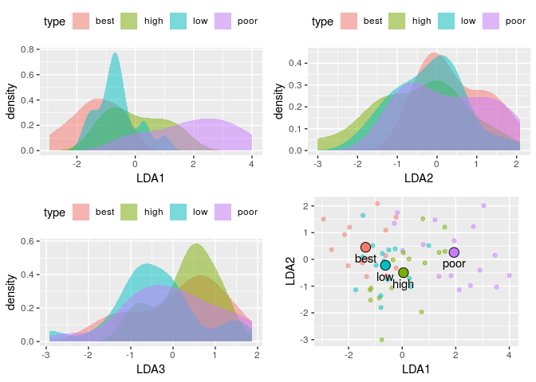

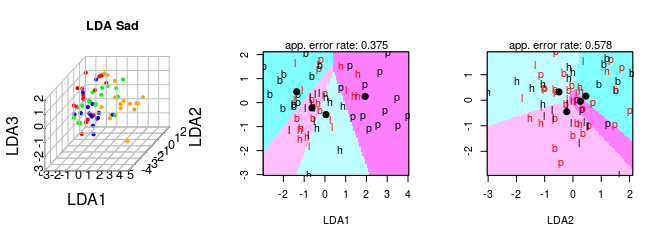

Figure 4. Cannonical Discriminant Analysis (CDA)
================================================

Two generalized canonical discriminant analysis was compute using the multivariate linear model:
*G**r**o**u**p* *n**b*0 + *n**b*2 + *n**b*4 + *n**b*8 + *n**b*16 + *n**b*32 + *n**b*64
to obtain the canonical scores and vectors, one for HAPPY and the other for SAD. It represents a transformation of the original variables in the scpace of maximal differences for the group. THe biplot shows the canonical scores for the groups defined by the term as points and the canonical structure coefficients as vectors from the origin.

Standardized beta coefficients are given for each variable in each discriminant (canonical) function, and the larger the standardized coefficient, the greater is the contribution of the respective variable to the discrimination between groups. However, these coefficients do not tell us between which of the groups the respective functions discriminate.

**Happy standardized coefficients**

<table style="width:61%;">
<caption>Happy CDA standardized coefficients</caption>
<colgroup>
<col width="15%" />
<col width="15%" />
<col width="15%" />
<col width="15%" />
</colgroup>
<thead>
<tr class="header">
<th align="center"> </th>
<th align="center">Can1</th>
<th align="center">Can2</th>
<th align="center">Can3</th>
</tr>
</thead>
<tbody>
<tr class="odd">
<td align="center"><strong>nb0</strong></td>
<td align="center">0.6264</td>
<td align="center">0.7113</td>
<td align="center">-0.3907</td>
</tr>
<tr class="even">
<td align="center"><strong>nb2</strong></td>
<td align="center">-0.1806</td>
<td align="center">0.3608</td>
<td align="center">0.1146</td>
</tr>
<tr class="odd">
<td align="center"><strong>nb4</strong></td>
<td align="center">0.507</td>
<td align="center">-0.6772</td>
<td align="center">-0.4067</td>
</tr>
<tr class="even">
<td align="center"><strong>nb8</strong></td>
<td align="center">-0.5025</td>
<td align="center">0.3103</td>
<td align="center">-0.6578</td>
</tr>
<tr class="odd">
<td align="center"><strong>nb16</strong></td>
<td align="center">-0.2266</td>
<td align="center">-0.4923</td>
<td align="center">-0.2479</td>
</tr>
<tr class="even">
<td align="center"><strong>nb32</strong></td>
<td align="center">-0.05239</td>
<td align="center">0.7701</td>
<td align="center">1.224</td>
</tr>
<tr class="odd">
<td align="center"><strong>nb64</strong></td>
<td align="center">-0.7641</td>
<td align="center">-0.08169</td>
<td align="center">-0.24</td>
</tr>
</tbody>
</table>

**Sad standardized coefficients**

<table style="width:61%;">
<caption>Sad CDA standardized coefficients</caption>
<colgroup>
<col width="15%" />
<col width="15%" />
<col width="15%" />
<col width="15%" />
</colgroup>
<thead>
<tr class="header">
<th align="center"> </th>
<th align="center">Can1</th>
<th align="center">Can2</th>
<th align="center">Can3</th>
</tr>
</thead>
<tbody>
<tr class="odd">
<td align="center"><strong>nb0</strong></td>
<td align="center">-1.011</td>
<td align="center">-0.05111</td>
<td align="center">0.04974</td>
</tr>
<tr class="even">
<td align="center"><strong>nb2</strong></td>
<td align="center">-0.01097</td>
<td align="center">-0.1844</td>
<td align="center">0.3217</td>
</tr>
<tr class="odd">
<td align="center"><strong>nb4</strong></td>
<td align="center">0.2952</td>
<td align="center">-0.4591</td>
<td align="center">-0.4602</td>
</tr>
<tr class="even">
<td align="center"><strong>nb8</strong></td>
<td align="center">-0.08152</td>
<td align="center">0.8909</td>
<td align="center">1.472</td>
</tr>
<tr class="odd">
<td align="center"><strong>nb16</strong></td>
<td align="center">-0.2719</td>
<td align="center">0.5762</td>
<td align="center">-1.304</td>
</tr>
<tr class="even">
<td align="center"><strong>nb32</strong></td>
<td align="center">0.06616</td>
<td align="center">-0.4042</td>
<td align="center">-0.1513</td>
</tr>
<tr class="odd">
<td align="center"><strong>nb64</strong></td>
<td align="center">0.4193</td>
<td align="center">0.4013</td>
<td align="center">-0.2076</td>
</tr>
</tbody>
</table>

The discriminant function coefficients denote the unique contribution of each variable to the discriminant function, while the structure coefficients denote the simple correlations between the variables and the functions

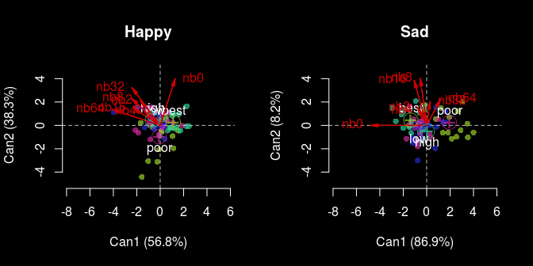
